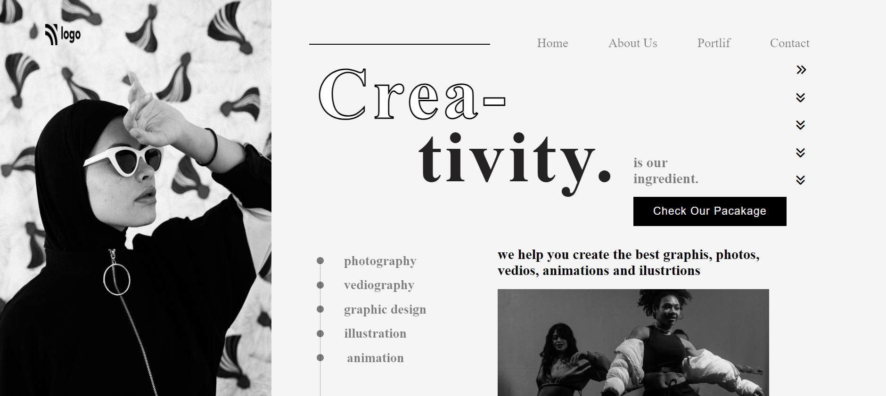

# creativity
- -wbkit-text-stroke-width/color so that we can give stroke to h1 tag
- margin-top/left and display-grid we can we use
- we nedd horizantal lines and vertical lines
- we need circle with background color so that use boarder-radius:50%

- 
- duration 4hrs